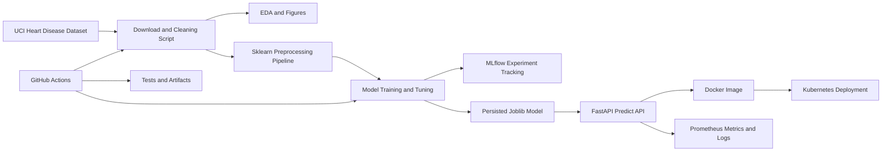

# BITS MLOps Assignment: Heart Disease Risk Prediction

This repository is a submit-ready MLOps assignment for building, tracking,
packaging, testing, containerizing, and deploying a heart disease classifier
from the UCI Cleveland Heart Disease dataset.

Repository: <https://github.com/tosenthu/bits-mlops>

## Problem Statement

Build a machine learning classifier to predict heart disease risk from patient
health data, then expose the trained model through a cloud-ready monitored API.

## Architecture



## Repository Layout

```text
.
├── .github/workflows/ci.yml
├── data/
│   ├── raw/
│   └── processed/
├── deployment/k8s/
├── models/
├── reports/
│   ├── figures/
│   └── screenshots/
├── sample_input/
├── scripts/
│   ├── download_data.py
│   ├── generate_report.py
│   └── run_eda.py
├── src/heart_disease_mlops/
├── tests/
├── Dockerfile
├── pyproject.toml
└── requirements.txt
```

## Local Setup

Use Python 3.10 or newer.

```bash
python -m venv .venv
source .venv/bin/activate
python -m pip install --upgrade pip
python -m pip install -r requirements.txt
python -m pip install -e .
```

## Data Acquisition and EDA

Download and clean the dataset:

```bash
python scripts/download_data.py
```

Generate the assignment EDA figures:

```bash
python scripts/run_eda.py
```

Outputs:

- `data/raw/heart_disease_uci.csv`
- `data/processed/heart_disease_clean.csv`
- `reports/figures/class_balance.png`
- `reports/figures/correlation_heatmap.png`
- `reports/figures/feature_histograms.png`

## Model Training and MLflow Tracking

Run a fast smoke training pass:

```bash
python -m heart_disease_mlops.train --fast
```

Run the fuller hyperparameter grid:

```bash
python -m heart_disease_mlops.train
```

Inspect experiments:

```bash
mlflow ui --backend-store-uri mlruns
```

Training outputs:

- `models/heart_disease_model.joblib`
- `models/model_metadata.json`
- `reports/metrics.json`
- `reports/figures/model_comparison.png`
- `mlruns/`

## Automated Tests and Lint

```bash
ruff check src scripts tests
pytest -q
```

The GitHub Actions workflow runs linting, tests, data download, EDA generation,
training, report generation, and artifact upload.

## API Serving

Start the API after training:

```bash
uvicorn heart_disease_mlops.api:app --host 0.0.0.0 --port 8000
```

Health check:

```bash
curl http://localhost:8000/health
```

Prediction:

```bash
curl -X POST http://localhost:8000/predict \
  -H "Content-Type: application/json" \
  -d @sample_input/patient_high_risk.json
```

Metrics endpoint:

```bash
curl http://localhost:8000/metrics
```

## Docker

Build the image:

```bash
docker build -t bits-mlops-heart:latest .
```

Run locally:

```bash
docker run --rm -p 8000:8000 bits-mlops-heart:latest
```

Verify:

```bash
curl -X POST http://localhost:8000/predict \
  -H "Content-Type: application/json" \
  -d @sample_input/patient_high_risk.json
```

## Kubernetes Deployment

For Minikube:

```bash
minikube start
eval $(minikube docker-env)
docker build -t bits-mlops-heart:latest .
kubectl apply -f deployment/k8s/namespace.yaml
kubectl apply -f deployment/k8s/deployment.yaml
kubectl apply -f deployment/k8s/service.yaml
kubectl -n bits-mlops rollout status deployment/heart-disease-api
kubectl -n bits-mlops get pods,svc
```

Use port forwarding:

```bash
kubectl -n bits-mlops port-forward svc/heart-disease-api 8000:80
curl http://localhost:8000/health
```

Optional ingress and Prometheus ServiceMonitor manifests are also included in
`deployment/k8s/`.

## Report

Generate the Word report after producing EDA and training artifacts:

```bash
python scripts/generate_report.py
```

Output:

- `reports/MLOps_Assignment_Report.docx`

## Screenshot and Video Checklist

Before final submission, capture screenshots into `reports/screenshots/`:

- EDA figures or notebook output.
- MLflow run list, metric details, and model artifacts.
- GitHub Actions successful workflow.
- Docker build and local `/predict` response.
- Kubernetes pods/services and API verification.
- `/metrics` output or Prometheus/Grafana dashboard.

Record a short video showing:

1. Repository structure.
2. Data download and EDA output.
3. Training and MLflow tracking.
4. Tests and CI workflow.
5. Docker/API prediction.
6. Kubernetes deployment or local access proof.
